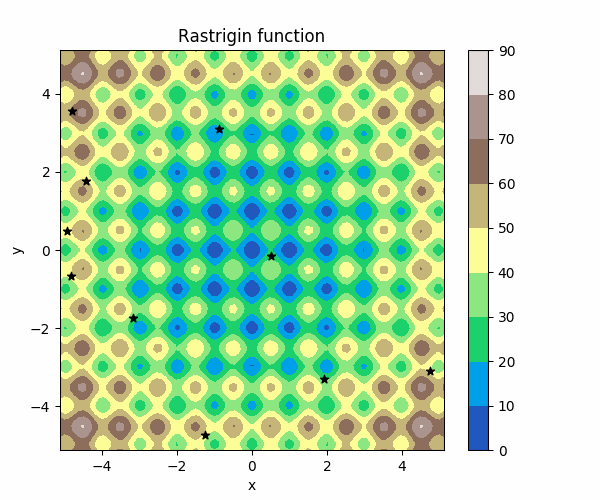

# Particle Swarm Optimization
В данном проекте представлена простейшая реализация алгоритма [PSO](https://en.wikipedia.org/wiki/Particle_swarm_optimization) на языке python с визуализацией через [matplotlib](https://matplotlib.org/).



### Зависимости:  
* python >= 2.7
* matplotlib
* numpy

### Запуск программы:  
В терминале в папке *scripts*:  
```bash
python ParticleSwarmOptimization.py
```  
**Примечание.** При запуске из-под linux могут потребоваться права доступа на выполнение файлов .py. Это делается командой:
```bash
chmod +x scripts/*.py
```  

### Доступные тестовые функции для оптимизации:  
* Функция Растригина  
* Сферическая функция
* Функция Экли
* Функция Матиаса
* Функция Розенброка

### Структура проекта:  
* files - файлы для визуализации в ReadMe.md
* scripts
    * Particle.py - алгоритм PSO
    * OptimizationFuncs.py - тестовые функции для оптимизации
    * ParticleSwarmOptimization.py - запуск работы алгоритма с визуализацией

### TODO:  
* Добавить комментарии к коду.
* Добавить выбор тестовой функции в терминале.
* Вынести параметры алгоритма в конфигурационный файл (например, yaml).
* Добавить формулы используемых функций.